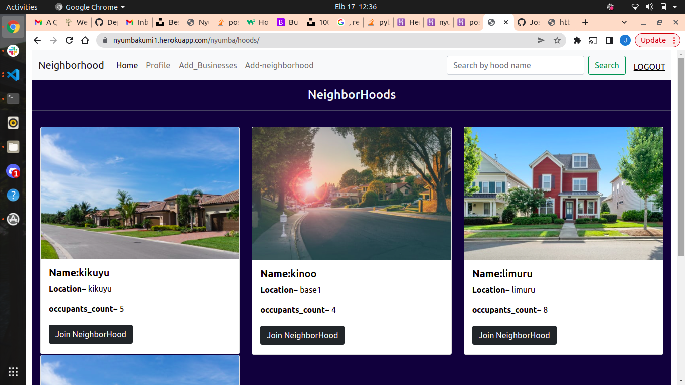

## NeighborHood App

## Created By Joseph Kamore Wairimu on 17-04-2022

## Design

 

## Description

NeighborHood App is a web application that allow users to register to a neighborhood and post their businesses and view other businesses in the neighborhood.

## Setup Requirements
Git

Python3

## Running the Application and cloning the repository
Open terminal:

git clone https://github.com/Joseph-Wairimu/neighbourhood.git

cd neighbourhood

pip install -r requirements.txt

python3 manage.py runserver

## Technologies Used
Python3

Django

Bootstrap5

## Product Management
Planning and development is iterative because I am constantly coding and improving my application as I learn new skills allowing me to make new changes and make the site more responsive.

## Support and contact details
Incase of any queries or any clarification you can contact me via email or phone.

email. josephkamore084@gmail.com

phone. 254706110898

## MIT License
Copyright (c) 2021 Joseph Kamore Wairimu
Permission is hereby granted, free of charge, to any person obtaining a copy of this software and associated documentation files (the "Software"), to deal in the Software without restriction, including without limitation the rights to use, copy, modify, merge, publish, distribute, sublicense, and/or sell copies of the Software, and to permit persons to whom the Software is furnished to do so, subject to the following conditions:

The above copyright notice and this permission notice shall be included in all copies or substantial portions of the Software.

THE SOFTWARE IS PROVIDED "AS IS", WITHOUT WARRANTY OF ANY KIND, EXPRESS OR IMPLIED, INCLUDING BUT NOT LIMITED TO THE WARRANTIES OF MERCHANTABILITY, FITNESS FOR A PARTICULAR PURPOSE AND NONINFRINGEMENT. IN NO EVENT SHALL THE AUTHORS OR COPYRIGHT HOLDERS BE LIABLE FOR ANY CLAIM, DAMAGES OR OTHER LIABILITY, WHETHER IN AN ACTION OF CONTRACT, TORT OR OTHERWISE, ARISING FROM, OUT OF OR IN CONNECTION WITH THE SOFTWARE OR THE USE OR OTHER DEALINGS IN THE SOFTWARE.